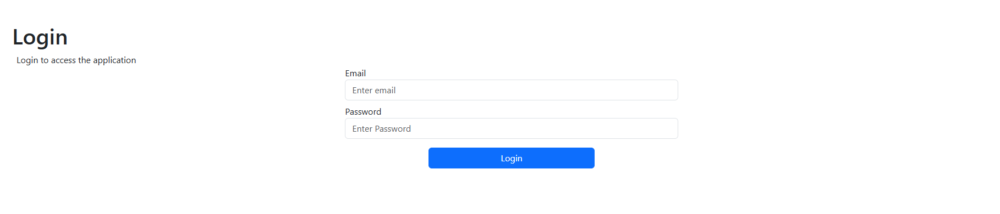
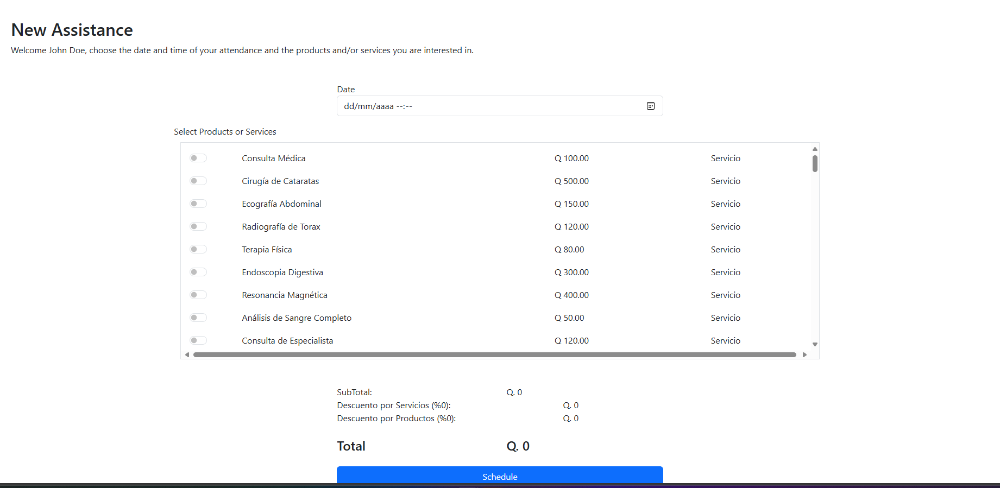
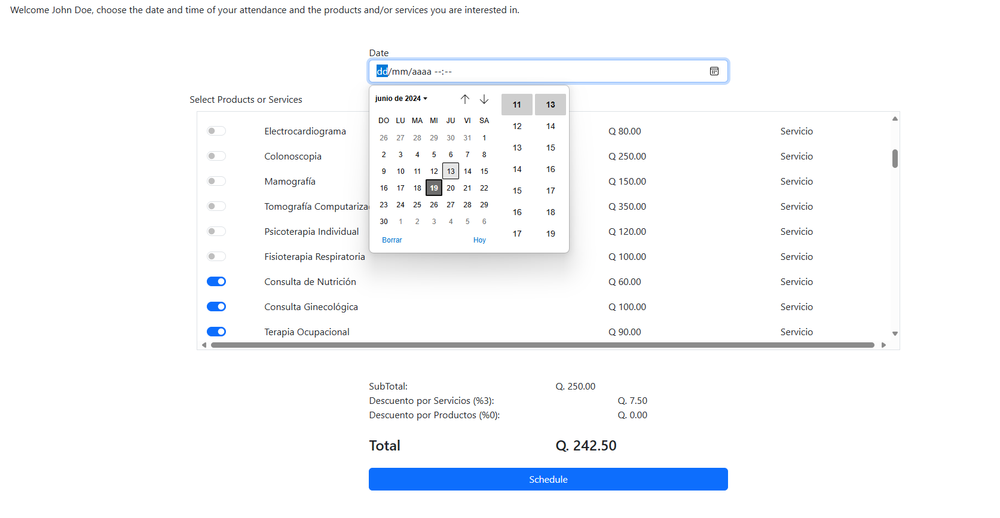
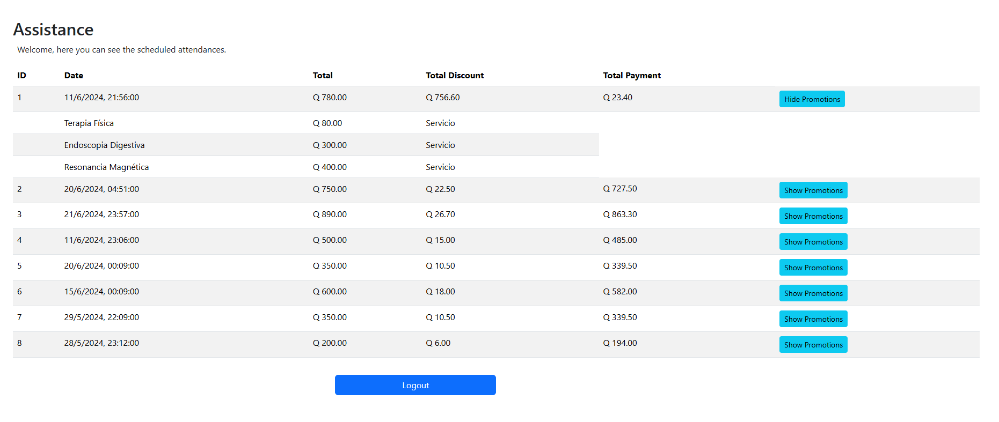

# Technical

- [Technical](#technical)
    - [Description 🚀](#description-)
    - [Prerequisitos:](#prerequisitos)
    - [Instalación 🔧](#instalación-)
      - [Backend](#backend)
      - [Frontend](#frontend)
      - [Despliegue](#despliegue)
    - [Demo 💻](#demo-)
    - [Seguridad](#seguridad)
    - [Contacto 📱](#contacto-)
    - [Licencia 📄](#licencia-)

### Description 🚀

_El departamento de ventas está por llevar a cabo un evento de promociones anuales sobre los diferentes servicios y productos de la empresa. Para ello se ha requerido al departamento de desarrollo la entrega de una plataforma en la que sus clientes puedan confirmar su asistencia y especificar los servicios y/o productos de su interés previo a su participación en el evento. Esto con la finalidad de preparar un portafolio de promociones personalizado para cada cliente que confirme su participación a través de dicha plataforma._

_Se tienen descuento del tipo:_
* _Servicios:_
- _Si el cliente está interesado en 2 o más Servicios el descuento será de 3%_
- _Si el cliente está interesado en 2 o más Servicios y la sumatoria del precio de estos sea mayor a Q.1,500 el descuento será de 5%_.
* _Productos:_
- _Si el cliente está interesado en 3 Productos o más el descuento será de 3%_
- _Si el cliente está interesado en 5 Productos o más el descuento será de 5%_

### Prerequisitos:

- [x] SO Windows 11. / Linux / MacOS
- [x] Docker v20.10.8+ 
- [x] Node v18.14.2+ y NPM v9.5.0+
- [x] Visual Studio Code v17.9.2+ _Optional_

### Instalación 🔧

- Descargar o Clonar el Repositorio de manera local.
- Verificar libertad de puertos 5000 y 3000 usados por la aplicación. _80 si se esta desplegando._

#### Backend

1. Dirigirse a `backend/` y abrir la solución en Visual Studio Code.
2. Ejecutar el comando `npm install` para instalar todas las dependencias necesarias.
3. Ejecutar el comando `npm start` para iniciar el servidor de desarrollo.
4. La API estará disponible en `http://localhost:5000/`.

#### Frontend

1. Dirigirse a `frontend` y abrirlo en Visual Studio Code.
2. Ejecutar el comando `npm install` para instalar las dependencias.
3. Ejecutar el comando `npm start` para abrir la interfaz.
4. La aplicación estará disponible en `http://localhost:3000/`.

#### Despliegue
La aplicación se encuentra desplegada en la nube de AWS, pero se puede acceder a ella a través de la siguiente URL: [Disagro Medical](http://3.86.40.29/login)

1. Para desplegar se debe connectar al servidor de AWS por ssh.
2. Dirigirse a la carpeta `/var/app/` y clonar el repositorio.
3. Ejecutar el comando `docker-compose up -d` para levantar los contenedores.
4. La aplicación estará disponible en el puerto 80.

Usuarios de prueba:
| Email                         | Pass       |
|-------------------------------|------------|
| john.doe@example.com          | password1  |
| jane.smith@example.com        | password2  |
| michael.johnson@example.com   | password3  |
| emily.williams@example.com    | password4  |
| james.brown@example.com       | password5  |
| emma.jones@example.com        | password6  |
| daniel.garcia@example.com     | password7  |
| olivia.martinez@example.com   | password8  |
| william.hernandez@example.com | password9  |
| sophia.lopez@example.com      | password10 |


### Demo 💻
Login de Usuario:


Agendar asistencia:


Detalle de asistencia:


Asistencias planificadas:


Pagina para paginas no encontradas:


### Seguridad

Se implemento seguridad en el backend con un JSONWEBTOKEN, para poder acceder a los endpoints se debe enviar un token de autenticación en el header de la petición.

La implementación de los metodos de seguridad en el backend se realio de la siguiente manera:
```typescript
    export function generateTokenJWT(data: User): string {   
    const token = jwt.sign(data , secretKey, { expiresIn: '8h' });
    return token;
}
```

Para realizar el consumo se necesita enviar el token en el header de la petición de la siguiente manera:
```javascript
GetAssistanceWithDetail = () => {
        return axios({
            method: "GET",
            url: `${environment.servicesUrl}/assistance/get`,
            data: null,
            headers: {
                "Content-Type": "application/json",
                "Authorization": `Bearer ${authenticate.getToken()}`
            },
            timeout: 10000
        });
    }
```
con esto podemos asegurar que solo los usuarios autorizados puedan acceder a los endpoints de la API.

### Contacto 📱

- developed by **Jefferson Geovanny Moreno Perez**<br>
- Telefono : +502 4521-7382

### Licencia 📄

[MIT](https://choosealicense.com/licenses/mit/)
